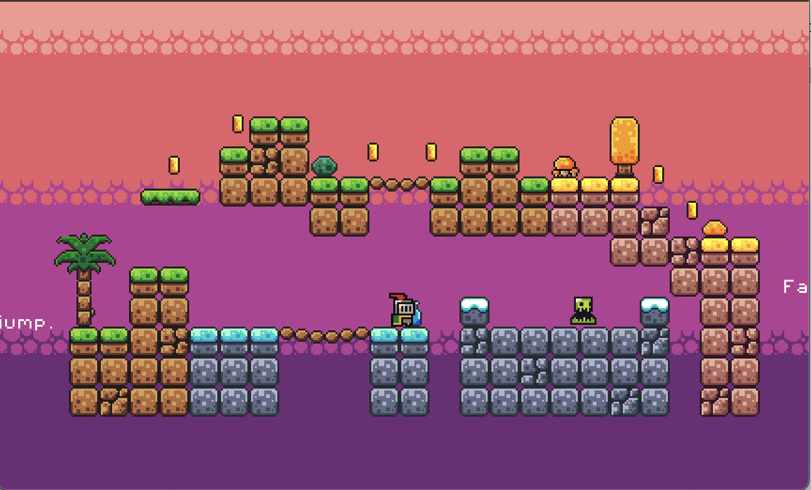

# 🎮 Adventure Game

Welcome to **Adventure Game**! A simple 2D platformer created using the **Godot Engine**.

## 📸 Game Screenshots
  

## ✨ Features
-  **Main Menu**: Start your journey or adjust settings with ease.
-  **Options Menu**: Customize music and sound effects volumes.

## 🕹️ How to Play
- **Controls**:
  - ➡ **Arrow left/right**: Move left and right.
  -  **Up Arrow, Space**: Jump.
  - 🖱️ **Mouse Click**: Interact with buttons.

- 🕹️ **Objective**:
  - Collect coins 💰, avoid Slimes👾, and reach the end zone to complete the level.
